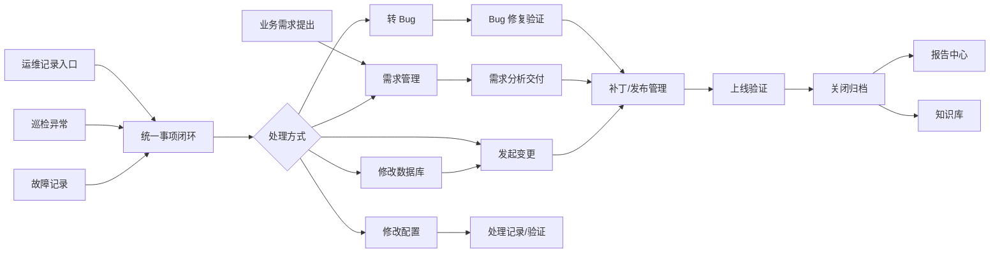

# 投资系统运维与需求闭环管理平台新版系统需求说明与设计说明

版本：v2.0
日期：2026-05-30
适用范围：投资系统运维、参数配置、系统功能问题、数据库处理、变更发布、衡泰需求、Bug 修复验证、报告归档全流程。

## 1. 编制背景

当前系统已经具备系统资产、值班巡检、故障变更、衡泰需求、Bug 管理、闭环事项和报告中心的基础能力，但模块之间联动仍偏弱。实际运维过程中，很多事项并不是一开始就能判断为需求或 Bug，而是先表现为“问题”：

- 参数配置不符合业务使用。
- 系统功能存在异常或体验问题。
- 数据异常需要临时修复或补数。
- 配置调整即可解决。
- 需要转 Bug 由厂商修复。
- 需要转需求进入正式评审、分析、排期和发布。
- 修复后还需要测试、验证、补丁号、发布记录和上线归档。

因此，新版系统不应只做“需求表”和“Bug 表”，而应升级为以“统一事项闭环”为底座，以“运维记录”为入口，以“变更、发布、验证、报告”为闭环出口的一体化平台。

## 2. 参考平台与提炼原则

本设计吸收成熟开源平台的核心思想，但不照搬页面和概念：

| 平台 | 可借鉴点 | 融入本项目的方式 |
| --- | --- | --- |
| GLPI | Ticket 可分为 Incident 和 Request，使用影响、紧急度、优先级；Ticket、Problem、Change 可相互关联；Change 具备影响分析、部署计划、备份计划、检查清单、验证和历史记录。 | 引入“运维记录 -> 问题分析 -> 处理方式 -> 变更/需求/Bug”的链路；变更发布必须记录影响、回退、验证、补丁号。 |
| Redmine | Tracker 区分 Bug、Feature、Defect 等不同事项类型；不同类型可配置不同工作流和字段；Issue 支持关联、子任务、日志。 | 闭环事项作为统一工作项，按来源类型配置不同状态流转、必填字段和权限。 |
| OpenProject | Work Package 可表示任务、功能、Bug、变更请求等；工作包可建立关联、阻塞、父子层级。 | 新增事项关系模型，支持“由此产生”“依赖”“阻塞”“重复”“父子拆分”。 |
| Bugzilla | Bug 生命周期强调修复完成后不是直接关闭，而是进入待验证/已验证/关闭；状态和 Resolution 分离。 | Bug 增加“修复完成、待验证、验证通过、验证不通过、已发布、已关闭”的闭环，并记录验证人、验证结论、补丁号。 |

参考来源：

- Redmine Issue Tracking Setup：https://www.redmine.org/projects/redmine/wiki/redmineissuetrackingsetup
- Redmine Issues and relations：https://www.redmine.org/projects/redmine/wiki/RedmineIssues
- GLPI Ticket life cycle：https://help.glpi-project.org/documentation/modules/assistance/tickets/ticketlifecycle
- GLPI Changes：https://help.glpi-project.org/documentation/modules/assistance/changes
- GLPI Managing problems：https://help.glpi-project.org/tutorials/helpdesk/problem
- OpenProject Work packages：https://www.openproject.org/docs/user-guide/work-packages
- OpenProject Work package relations：https://www.openproject.org/docs/user-guide/work-packages/work-package-relations-hierarchies
- Bugzilla Understanding a Bug：https://bz.apache.org/bugzilla/docs/en/html/using/understanding.html

## 3. 系统总体定位

系统定位为“投资系统运维与交付闭环管理平台”。

平台需要统一承载：

- 日常运维记录受理。
- 参数配置处理。
- 数据库处理。
- 系统功能问题判断。
- Bug 提交、修复、验证、发布。
- 需求提出、分析、反馈方案、优化、排期、开发、验收、上线。
- 生产变更、补丁发布、发布验证和回退。
- 周/月/专项报告导出。

目标不是简单登记，而是回答以下问题：

- 这个问题从哪里来？
- 影响哪个系统、哪个模块、哪个业务部门？
- 现在归谁处理？
- 处理方式是什么？
- 是否改过数据库或配置？
- 是否转成 Bug 或需求？
- 是否发过补丁，补丁号是什么？
- 什么时候变更，谁审批，谁执行，谁验证？
- 是否按时响应、分析、反馈、修复、发布和关闭？
- 最终是否闭环，有没有证据和报告？

## 4. 总体业务架构



## 5. 核心设计原则

1. 所有问题先入闭环，不允许口头处理无记录。
2. 运维记录、Bug、需求、变更、发布均可独立创建，也可相互转化。
3. 每个业务对象都有自己的编号，但通过统一事项编号串联。
4. 状态流转必须有日志，关键状态必须有时间和责任人。
5. 修改数据库、修改配置、发补丁、生产发布必须留痕。
6. Bug 修复完成不等于关闭，必须验证通过后才能关闭。
7. 需求上线不等于闭环，必须验收通过、发布记录完整后归档。
8. 所有超时事项进入报告和预警。
9. 删除采用逻辑删除，已编号事项全生命周期保留。
10. 字典项统一维护，避免手工输入导致统计失真。

## 6. 核心对象模型

### 6.1 统一事项 OpsWorkItem

统一事项是所有模块的总线，不替代业务明细表，而是提供统一看板、统一超期、统一报告。

核心字段：

| 字段 | 说明 |
| --- | --- |
| 事项编号 | 自动生成，如 `ISSUE-20260530-001`、`REQ-20260530-001`、`BUG-20260530-001` |
| 事项类型 | 运维记录、参数配置、数据处理、需求、Bug、故障、变更、发布、其他 |
| 来源模块 | `OPS_ISSUE`、`HT_REQUIREMENT`、`HT_BUG`、`OPS_CHANGE`、`OPS_RELEASE` |
| 来源记录ID | 业务表主键，前端不展示为可填项 |
| 关联系统 | 系统资产 |
| 标题 | 事项摘要 |
| 优先级 | P0/P1/P2/P3 |
| 当前状态 | 待处理、处理中、待验证、待发布、已关闭、已驳回 |
| 责任人 | 当前处理负责人 |
| 提出人 | 业务或运维提出人 |
| 提出时间 | 进入系统时间 |
| 计划完成时间 | SLA 或排期时间 |
| 实际完成时间 | 关闭或上线时间 |
| 处理进展 | 最新进展 |
| 验收结果 | 通过/不通过 |
| 关闭说明 | 闭环说明 |
| 逾期标识 | 系统自动计算 |

### 6.2 运维记录 OpsIssue

运维记录是新版系统最重要的入口。

编号规则：

`OPS-ISSUE-YYYYMMDD-XXX`

核心字段：

| 字段 | 类型 | 说明 |
| --- | --- | --- |
| 问题编号 | 自动生成 | 唯一编号 |
| 问题类型 | 字典 | 参数配置、系统功能、数据异常、操作流程、性能、权限、其他 |
| 关联系统 | 选择 | 系统资产 |
| 所属模块 | 字典 | 交易、估值、清算、报表、权限、接口、其他 |
| 问题标题 | 文本 | 简洁描述 |
| 问题描述 | 长文本 | 现象、场景、影响 |
| 发现来源 | 字典 | 值班、巡检、业务反馈、厂商反馈、监控告警、会议 |
| 影响范围 | 字典/文本 | 单用户、部门、全系统、核心交易等 |
| 优先级 | 字典 | P0/P1/P2/P3 |
| 发现人 | 文本 | 发现人员 |
| 发现时间 | 日期 | 问题出现或反馈时间 |
| 负责人 | 选择 | 当前处理人 |
| 当前状态 | 字典 | 待受理、分析中、处理中、待验证、已转Bug、已转需求、已转变更、已关闭、已驳回 |
| 处理方式 | 字典 | 修改配置、修改数据库、操作处理、转Bug、转需求、转变更、无需处理、观察跟踪 |
| 处理结果 | 文本 | 处理结论 |
| 根因分类 | 字典 | 配置、数据、程序、操作、环境、权限、业务规则 |
| 关联事项ID | 系统字段 | 统一事项 |
| 关联Bug编号 | 系统字段 | 转 Bug 后回写 |
| 关联需求编号 | 系统字段 | 转需求后回写 |
| 关联变更编号 | 系统字段 | 涉及生产变更时回写 |

### 6.3 参数配置处理 OpsConfigAction

用于记录“改配置即可解决”的处理证据。

编号规则：

`CFG-YYYYMMDD-XXX`

核心字段：

- 配置处理编号
- 关联问题编号
- 关联系统
- 配置项名称
- 配置项位置
- 原配置值
- 新配置值
- 生效方式：即时生效、重启生效、发布生效
- 是否涉及生产变更
- 操作人
- 操作时间
- 验证人
- 验证结果
- 回退方式

### 6.4 数据库处理 OpsDbAction

用于记录补数、修数、删数、脚本执行等动作。

编号规则：

`DBA-YYYYMMDD-XXX`

核心字段：

- 数据处理编号
- 关联问题编号
- 关联系统
- 数据库实例
- 操作类型：查询、修数、补数、删除、初始化、脚本执行
- SQL 脚本摘要
- 脚本附件
- 影响表
- 影响数据量
- 备份方式
- 回滚脚本
- 审批人
- 执行人
- 执行时间
- 验证人
- 验证结果

规则：

- 生产修数必须关联变更。
- P0/P1 数据处理必须记录审批和回滚。
- SQL 明文可按安全要求脱敏或仅存附件。

### 6.5 衡泰需求 HtRequirement

需求可由业务单独提出，也可由运维记录转入。

编号规则：

`部门缩写-REQ-YYYYMMDD-XXX`

新增关键字段：

| 字段 | 说明 |
| --- | --- |
| 需求来源 | 手工提出、运维记录转入、Bug衍生、会议决议 |
| 来源问题编号 | 运维记录转入时自动带出 |
| 来源Bug编号 | Bug 衍生需求时自动带出 |
| 需求提出日期 | 用于编号和 SLA |
| 初审完成时间 | 信息技术部初审时间 |
| 厂商响应时间 | 衡泰首次响应 |
| 分析反馈时间 | 厂商反馈方案时间 |
| 方案确认时间 | 业务确认方案 |
| 计划排期时间 | 厂商计划启动 |
| 开发完成时间 | 厂商开发完成 |
| 测试验收时间 | 内部验收 |
| 上线时间 | 正式上线 |
| 发布编号 | 上线发布记录 |
| 补丁号 | 涉及补丁时填写 |

需求状态流转：

```text
待初审
  -> 待分析
  -> 分析中
  -> 待反馈方案
  -> 待业务确认
  -> 商务流程中
  -> 待排期
  -> 开发中
  -> 待内测
  -> 待验收
  -> 待发布
  -> 已上线
  -> 已归档
```

特殊流转：

- 任意分析前状态可驳回。
- 验收不通过回到开发中。
- 发布失败回到待发布或开发中。
- 已上线但业务验证不通过，可重新打开并产生 Bug。

### 6.6 Bug HtBugRecord

Bug 可由运维记录转入、需求验收产生，也可单独登记。

编号规则：

`BUG-YYYYMMDD-XXX`

新增关键字段：

| 字段 | 说明 |
| --- | --- |
| Bug来源 | 运维记录、需求验收、生产验证、巡检、手工登记 |
| 来源问题编号 | 从运维记录转入时记录 |
| 关联需求编号 | 来源需求或影响需求 |
| 复现步骤 | 必填 |
| 预期结果 | 必填 |
| 实际结果 | 必填 |
| 影响版本 | 出问题版本 |
| 修复版本 | 计划修复版本 |
| 补丁号 | 如 `PATCH-20260601-001` |
| 发布编号 | 关联发布记录 |
| 修复人 | 厂商或内部人员 |
| 修复完成时间 | 修复提交时间 |
| 验证人 | 韩宝国、余如飞或指定人员 |
| 验证环境 | 测试、准生产、生产 |
| 验证结论 | 通过、不通过、部分通过 |
| 关闭人 | 最终关闭人 |

Bug 状态流转：

```text
待确认
  -> 已确认
  -> 已分派
  -> 修复中
  -> 修复完成
  -> 待验证
  -> 验证通过
  -> 待发布
  -> 已发布
  -> 生产验证通过
  -> 已关闭
```

特殊流转：

- 待确认 -> 已驳回。
- 待验证 -> 验证不通过 -> 修复中。
- 已发布 -> 生产验证不通过 -> 重新打开。
- Bug 不是缺陷但需要优化时，可转需求。

### 6.7 变更管理 OpsChangeRecord

变更是生产环境有影响动作的管控对象。

适用场景：

- 修改数据库。
- 修改生产配置。
- 发布补丁。
- 上线新需求。
- 修复生产 Bug。
- 调整权限、接口、定时任务、批处理。

编号规则：

`CHG-YYYYMMDD-XXX`

核心字段：

- 变更编号
- 变更类型：配置变更、数据库变更、应用发布、权限变更、接口变更、其他
- 变更来源：问题、Bug、需求、故障、手工
- 来源编号
- 关联系统
- 计划变更时间
- 实际开始时间
- 实际结束时间
- 变更窗口
- 影响范围
- 风险等级
- 变更内容
- 执行步骤
- 回退方案
- 验证方案
- 审批人
- 执行人
- 验证人
- 变更结果

状态流转：

```text
待申请 -> 待审批 -> 已审批 -> 待执行 -> 执行中 -> 待验证 -> 验证通过 -> 已完成
```

异常流转：

- 待审批 -> 已驳回。
- 执行中 -> 已回退。
- 待验证 -> 验证不通过 -> 已回退或重新执行。

### 6.8 发布与补丁 OpsRelease

发布管理用于承接需求、Bug、配置变更、数据库变更最终落地。

编号规则：

发布编号：`REL-YYYYMMDD-XXX`
补丁号：`PATCH-YYYYMMDD-XXX`

核心字段：

| 字段 | 说明 |
| --- | --- |
| 发布编号 | 自动生成 |
| 补丁号 | 可手工填写或系统生成 |
| 发布类型 | 需求上线、Bug修复、配置发布、数据库脚本、紧急补丁 |
| 关联系统 | 系统资产 |
| 关联需求 | 多选 |
| 关联Bug | 多选 |
| 关联变更 | 必选或自动生成 |
| 版本号 | 应用版本 |
| 补丁包名称 | 文件或包名 |
| 发布时间 | 实际发布时间 |
| 发布人 | 执行人 |
| 验证人 | 验证人员 |
| 发布结果 | 成功、失败、回退、部分成功 |
| 生产验证结果 | 通过、不通过 |
| 回退说明 | 发布失败时必填 |
| 发布说明 | 归档说明 |

规则：

- 一个发布可以包含多个需求和 Bug。
- 一个 Bug 可以被多个发布关联，但只有一个最终修复发布。
- 发布成功后不自动关闭 Bug，必须生产验证通过后关闭。
- 发布失败必须记录回退方案和结果。

## 7. 事项关系设计

新增统一关系表 `ops_item_relation`。

核心字段：

| 字段 | 说明 |
| --- | --- |
| relation_id | 主键 |
| source_type | 来源对象类型 |
| source_id | 来源对象ID |
| source_no | 来源编号 |
| target_type | 目标对象类型 |
| target_id | 目标对象ID |
| target_no | 目标编号 |
| relation_type | 关系类型 |
| relation_desc | 关系说明 |

关系类型建议：

- `GENERATE`：由此产生，如问题转 Bug。
- `CONVERT_TO`：转为，如问题转需求。
- `RELATE_TO`：普通关联。
- `BLOCKED_BY`：被阻塞。
- `BLOCKS`：阻塞其他事项。
- `DUPLICATE`：重复。
- `PARENT_CHILD`：父子拆分。
- `RELEASED_BY`：由某发布上线。
- `CHANGED_BY`：由某变更实施。

示例：

```text
OPS-ISSUE-20260530-001
  GENERATE -> BUG-20260530-001
BUG-20260530-001
  RELEASED_BY -> REL-20260601-001
REL-20260601-001
  CHANGED_BY -> CHG-20260601-001
```

## 8. 时效 SLA 设计

### 8.1 优先级定义

| 优先级 | 场景 | 响应时效 | 方案反馈 | 修复/处理目标 |
| --- | --- | --- | --- | --- |
| P0 | 核心交易、清算、估值不可用或重大数据风险 | 2小时内 | 24小时内 | 优先紧急处理，必要时每日跟踪 |
| P1 | 重要功能异常、影响部门业务办理 | 1个工作日内 | 3个工作日内 | 明确排期并持续跟踪 |
| P2 | 一般功能问题、体验优化、普通需求 | 3个工作日内 | 1周内 | 纳入常规计划 |
| P3 | 建议类、低频优化 | 统一评审 | 统一反馈 | 纳入需求池 |

### 8.2 运维记录 SLA

| 节点 | P0 | P1 | P2/P3 |
| --- | --- | --- | --- |
| 受理 | 2小时 | 1工作日 | 3工作日 |
| 初步分析 | 4小时 | 2工作日 | 5工作日 |
| 处理方案 | 24小时 | 3工作日 | 1周 |
| 验证关闭 | 按处置完成后当日 | 2工作日 | 5工作日 |

### 8.3 Bug SLA

| 节点 | P0 | P1 | P2 | P3 |
| --- | --- | --- | --- | --- |
| 确认 | 2小时 | 1工作日 | 3工作日 | 统一评审 |
| 修复方案 | 24小时 | 3工作日 | 1周 | 需求池/版本计划 |
| 修复完成 | 视影响每日跟进 | 按排期 | 按排期 | 按版本 |
| 验证 | 修复后当日 | 2工作日 | 5工作日 | 按版本 |

### 8.4 需求 SLA

| 节点 | 时效 |
| --- | --- |
| 信息技术部初审与编号 | 当日 |
| 周会评审 | 每周例会 |
| 厂商分析反馈 | 次周周会或约定时点 |
| 业务确认 | 1周内 |
| 商务完成后最终确认 | 2周内 |
| 排期开发 | 按厂商排期 |
| 验收反馈 | 验收发起后3个工作日内 |

## 9. 状态联动规则

### 9.1 运维记录转 Bug

触发条件：

- 处理方式选择“转 Bug”。
- 问题类型为系统功能、程序异常、接口异常、批处理异常等。

系统动作：

1. 自动生成 Bug 编号。
2. 自动带入系统、模块、标题、描述、优先级、发现人。
3. 创建事项关系：问题 `GENERATE` Bug。
4. 运维记录状态变为“已转 Bug”。
5. Bug 状态进入“待确认”。
6. 统一事项看板显示该问题后续由 Bug 推动。

### 9.2 运维记录转需求

触发条件：

- 处理方式选择“转需求”。
- 问题不是缺陷，而是规则调整、流程优化、功能增强或新增功能。

系统动作：

1. 弹出需求创建窗口。
2. 自动带出系统、模块、描述、业务价值草稿。
3. 根据部门和日期生成需求编号。
4. 创建事项关系：问题 `CONVERT_TO` 需求。
5. 运维记录状态变为“已转需求”。
6. 需求进入“待初审”或“待分析”。

### 9.3 Bug 转需求

适用场景：

- 厂商判定不是缺陷，而是新功能。
- 业务希望借缺陷修复过程扩展能力。
- 修复成本高，需要改造方案。

系统动作：

- Bug 状态可设为“转需求”或“已驳回并转需求”。
- 自动创建需求并保留 Bug 关联。
- 报告中统计“Bug 转需求数”。

### 9.4 需求产生 Bug

适用场景：

- 需求验收发现缺陷。
- 上线后业务验证发现问题。

系统动作：

- 从需求详情发起 Bug。
- Bug 自动关联需求编号和发布编号。
- 需求状态可保持“待验收”或进入“上线问题处理中”。

### 9.5 变更与发布联动

规则：

- 数据库处理、生产配置修改、补丁发布必须关联变更。
- 需求上线和 Bug 修复上线必须关联发布。
- 发布记录必须关联变更。
- 发布成功后进入生产验证。
- 生产验证通过后，关联 Bug/需求才能最终关闭或归档。

## 10. 页面与菜单规划

建议菜单结构：

```text
运维管理
  工作台
  基础资源
  运维受理
    运维记录
    参数配置处理
    数据库处理
  值班巡检
  故障变更
    故障记录
    变更管理
    发布管理
  闭环中心
    事项闭环
    事项关系图
    逾期预警
  衡泰需求
    需求登记
    需求分析
    需求排期
    需求验收
    需求归档
  Bug管理
    Bug登记
    修复跟踪
    验证回归
    发布关闭
  报告中心
    综合报告
    运维记录报告
    需求交付报告
    Bug修复报告
    变更发布报告
  知识库
```

## 11. 关键页面设计

### 11.1 运维记录页面

列表字段：

- 问题编号
- 问题标题
- 问题类型
- 系统名称
- 优先级
- 当前状态
- 处理方式
- 负责人
- 发现时间
- 计划完成时间
- 是否逾期
- 关联 Bug
- 关联需求

详情页分区：

1. 基础信息。
2. 问题描述。
3. 影响与优先级。
4. 处理判断。
5. 关联对象。
6. 处理日志。
7. 附件与证据。

动作按钮：

- 受理
- 分派
- 修改配置
- 修改数据库
- 转 Bug
- 转需求
- 发起变更
- 验证通过
- 关闭

### 11.2 Bug 页面

新增分区：

1. 基础信息。
2. 复现信息。
3. 修复信息。
4. 验证信息。
5. 发布信息。
6. 关闭信息。

关键按钮：

- 确认 Bug
- 分派修复
- 提交修复
- 发起验证
- 验证通过
- 验证不通过
- 关联发布
- 生产验证通过
- 关闭
- 转需求

### 11.3 需求页面

新增分区：

1. 需求提出。
2. 初审与编号。
3. 厂商分析。
4. 反馈方案。
5. 商务流程。
6. 排期开发。
7. 验收与优化。
8. 发布上线。
9. 归档。

关键按钮：

- 初审通过
- 驳回
- 提交厂商分析
- 反馈方案
- 业务确认
- 进入商务
- 排期
- 开发完成
- 发起验收
- 验收不通过
- 验收通过
- 关联发布
- 上线归档
- 产生 Bug

### 11.4 发布页面

发布单需要展示：

- 发布编号
- 补丁号
- 版本号
- 关联需求
- 关联 Bug
- 关联变更
- 发布内容
- 发布步骤
- 验证清单
- 回退方案
- 发布结果
- 生产验证结果

## 12. 报告中心设计

### 12.1 综合管理报告

内容：

- 本期新增运维记录数。
- 本期闭环问题数。
- 本期转 Bug 数。
- 本期转需求数。
- 本期修改数据库次数。
- 本期修改配置次数。
- 本期发布次数。
- 本期补丁数量。
- P0/P1 重点事项。
- 逾期事项。
- 未验证 Bug。
- 待发布需求。
- 生产变更成功率。

### 12.2 Bug 修复验证报告

字段：

- Bug 编号
- 关联需求
- 来源问题
- 严重程度
- 优先级
- 修复人
- 修复完成时间
- 验证人
- 验证时间
- 验证结果
- 发布编号
- 补丁号
- 生产验证结果
- 关闭时间

### 12.3 需求交付报告

字段：

- 需求编号
- 提出部门
- 需求名称
- 优先级
- 提出时间
- 分析反馈时间
- 方案确认时间
- 排期时间
- 开发完成时间
- 验收结果
- 发布编号
- 补丁号
- 上线时间
- 当前状态

### 12.4 变更发布报告

字段：

- 变更编号
- 发布编号
- 补丁号
- 变更类型
- 计划变更时间
- 实际变更时间
- 影响系统
- 风险等级
- 执行人
- 验证人
- 变更结果
- 回退情况

## 13. 数据字典规划

新增字典建议：

- `ops_issue_type`：参数配置、系统功能、数据异常、操作流程、性能、权限、其他。
- `ops_issue_status`：待受理、分析中、处理中、待验证、已转Bug、已转需求、已转变更、已关闭、已驳回。
- `ops_handle_method`：修改配置、修改数据库、操作处理、转Bug、转需求、转变更、无需处理、观察跟踪。
- `ops_root_cause`：配置、数据、程序、操作、环境、权限、业务规则。
- `ops_change_type`：配置变更、数据库变更、应用发布、权限变更、接口变更、其他。
- `ops_change_status`：待申请、待审批、已审批、待执行、执行中、待验证、已完成、已驳回、已回退。
- `ops_release_type`：需求上线、Bug修复、配置发布、数据库脚本、紧急补丁。
- `ops_release_status`：待发布、发布中、发布成功、发布失败、已回退、生产验证通过、生产验证不通过。
- `ht_bug_status`：待确认、已确认、已分派、修复中、修复完成、待验证、验证通过、验证不通过、待发布、已发布、生产验证通过、已关闭、已驳回、已转需求。
- `ht_req_status`：待初审、待分析、分析中、待反馈方案、待业务确认、商务流程中、待排期、开发中、待内测、待验收、待发布、已上线、已归档、已驳回。
- `ops_relation_type`：由此产生、转为、关联、阻塞、被阻塞、重复、父子、由发布上线、由变更实施。

## 14. 权限设计

| 角色 | 权限重点 |
| --- | --- |
| 信息技术部管理员 | 全模块维护、编号、分派、关闭、报告 |
| 运维人员 | 问题受理、配置处理、数据库处理、变更申请、验证 |
| 业务部门用户 | 提需求、反馈问题、确认方案、验收 |
| 厂商人员 | 需求分析、Bug 修复、方案反馈、工期反馈 |
| 验收人员 | Bug 验证、需求验收、生产验证 |
| 管理层 | 看板、报告、导出 |

关键权限：

- 只有授权人员可修改数据库处理记录。
- 只有验收人员可将 Bug 从“待验证”置为“验证通过”。
- 只有发布负责人可填写发布结果和补丁号。
- 只有管理员或提出部门可最终关闭需求。

## 15. 审计与日志

所有关键动作必须记录：

- 状态变化前后值。
- 操作人。
- 操作时间。
- 操作说明。
- 附件。
- 关联对象。

审计范围：

- 问题转 Bug。
- 问题转需求。
- Bug 验证不通过。
- 需求验收不通过。
- 修改数据库。
- 修改配置。
- 发起变更。
- 发布补丁。
- 生产验证。
- 关闭归档。

## 16. 实施路线

### 阶段一：补强关联模型

- 新增 `ops_item_relation`。
- 统一所有模块关联关系。
- 闭环中心增加来源链路展示。

### 阶段二：新增运维记录入口

- 新增运维记录表、接口、页面。
- 支持处理方式选择。
- 支持转 Bug、转需求。

### 阶段三：补齐配置处理和数据库处理

- 新增参数配置处理记录。
- 新增数据库处理记录。
- 数据库处理可发起变更。

### 阶段四：强化 Bug 修复验证

- 扩展 Bug 状态。
- 增加复现、修复、验证、补丁号、发布编号。
- 验证不通过自动回退修复中。

### 阶段五：强化需求交付流程

- 扩展需求状态。
- 增加分析反馈、方案确认、优化、发布、归档节点。
- 支持需求产生 Bug。

### 阶段六：新增发布与补丁管理

- 新增发布表。
- 支持关联需求、Bug、变更。
- 支持补丁号和生产验证。

### 阶段七：完善报告中心

- 增加综合报告。
- 增加 Bug 修复验证报告。
- 增加需求交付报告。
- 增加变更发布报告。
- 支持 Excel 先行，后续扩展 Word/PDF。

## 17. 与当前系统的差异

当前系统已有：

- 统一闭环事项。
- 衡泰需求管理。
- Bug 管理。
- 报告中心。
- 菜单、字典、建表基础。

新版需要补强：

- 运维记录入口。
- 参数配置处理。
- 数据库处理。
- 事项关系表。
- Bug 验证和发布闭环。
- 需求分析反馈和发布归档闭环。
- 补丁号和发布单。
- 变更窗口、审批、回退、验证。
- 报告维度细化。

## 18. 结论

新版系统应从“需求/Bug登记系统”升级为“运维记录驱动的全流程闭环平台”。

核心主线是：

```text
发现问题
  -> 受理分析
  -> 判断处理方式
  -> 配置/数据库/操作处理
  -> 或转 Bug / 转需求 / 转变更
  -> 修复或开发
  -> 变更发布
  -> 验证
  -> 关闭归档
  -> 报告输出
```

这样才能把参数配置、功能问题、数据库处理、需求、Bug、补丁、变更、发布和报告真正串成一条链路，支撑信息技术部对衡泰及内部系统运维的全过程管理。
